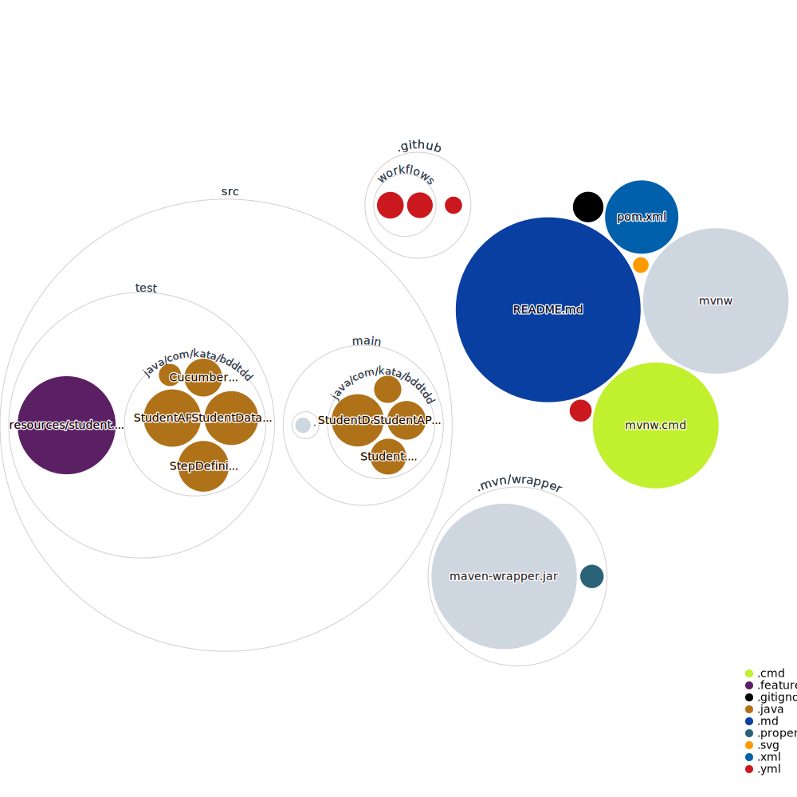

# Introduction

## BDD and TDD
BDD stands for Behaviour Driven Development, It's an agile software development process that encourages collaboration among developers, quality assurance testers, and customer representatives in a software project.

You can refer below links to learn more about BDD:
- https://www.merixstudio.com/blog/behavior-driven-development-python
- https://cucumber.io/blog/2015/12/08/example-mapping-introduction
- https://www.youtube.com/watch?v=VwvrGfWmG_U
- https://github.com/behave/behave
- https://www.amazon.co.uk/Specification-Example-Successful-Deliver-Software/dp/1617290084
- http://bddbooks.com/
- https://pragprog.com/book/hwcuc/the-cucumber-book
- https://inviqa.com/blog/bdd-guide
- https://leanpub.com/50quickideas-tests
- https://testing.googleblog.com/2015/04/just-say-no-to-more-end-to-end-tests.html

TDD stands for Test Driven Development, It's a software development process relying on software requirements being converted to test cases before software is fully developed, and tracking all software development by repeatedly testing the software against all test cases.

You can refer below links to learn more about BDD:
- https://www.infoq.com/news/2009/03/TDD-Improves-Quality
- https://medium.com/@carlosalmonte04/tdd-why-use-it-7747e6e091c4
- https://ieeexplore.ieee.org/abstract/document/1251029/
- https://www.upwork.com/hiring/for-clients/test-driven-development/
- https://dl.acm.org/citation.cfm?id=2915996
- https://cloudnative.ly/which-order-to-write-your-tests-7ea2937761a1

## Application Requirement

Currently, we need to expose a GET endpoint that allows the client to search for students whose nameprefix matches the requested string.

Example request and response:
```shell
Request:
http://localhost:8080/search/a

Response:
[{"firstName":"abhishek","lastName":"rajput"},{"firstName":"ash","lastName":"ketchum"}]
```

Thanks to [repo-visualization](https://octo.github.com/projects/repo-visualization) for giving us enough of a “fingerprint” to glance and see the structure of the codebase as below:



## Applying BDD in Spring Boot for automation

We are following BDD first approach where we wrote a failing feature/acceptance criteria thus driving our development through behavior and then followed by Test Driven Development.
A feature is not considered as developed until all the Unit Tests (TDD) and feature (BDD) passes.

### Adding required dependencies

To learn more about how to build a basic Spring boot application [click here](https://spring.io/guides/gs/spring-boot/).

We are using Cucumber framework for implementing BDD in this boot.

Please add below dependencies in your pom.xml
```xml
                <dependency>
			<groupId>io.cucumber</groupId>
			<artifactId>cucumber-core</artifactId>
			<version>6.8.0</version>
			<scope>test</scope>
		</dependency>
		<dependency>
			<groupId>io.cucumber</groupId>
			<artifactId>cucumber-java</artifactId>
			<version>6.8.0</version>
			<scope>test</scope>
		</dependency>
		<dependency>
			<groupId>io.cucumber</groupId>
			<artifactId>cucumber-junit</artifactId>
			<version>6.8.0</version>
			<scope>test</scope>
		</dependency>
		<dependency>
			<groupId>io.cucumber</groupId>
			<artifactId>cucumber-spring</artifactId>
			<version>6.8.0</version>
			<scope>test</scope>
		</dependency>

```

In terminal execute below command to download all dependencies.
```bash
./mvnw install
```

### Add features and Spring-Cucumber Integration
- Create a resources subdirectory inside the test directory as `src/test/resources` and add a feature file called student.feature as below:

```gherkin
Feature: Retrieve Student Information
  Scenario: When a name prefix is passed all the students information starting with that is returned
    Given Student enters name prefix "n"
    When The student makes a call to "http://localhost:8080/search/" get the details
    Then The API should return the student details and response code 200
```

- Create a CucumberIntegration.java (you may have any relevant name) class in the test directory as below:
```java
@RunWith(Cucumber.class)
@CucumberContextConfiguration
@SpringBootTest(
        classes = BDDTDDKataApplication.class,
        webEnvironment = SpringBootTest.WebEnvironment.DEFINED_PORT)
@CucumberOptions(features = "src/test/resources", plugin = {"pretty",
        "html:build/reports/cucumber/cucumber-report.html"})
public class CucumberIntegration {
}
```

- Create another class called StepDefinition.java (you may have any relevant name) and add below step definitions which are code implementation of the feature that we have added.
```java
package com.kata.bddtdd;

import io.cucumber.java.en.Given;
import io.cucumber.java.en.Then;
import io.cucumber.java.en.When;

public class StepDefinition {

    @Given("Student enters name prefix {string}")
    public void student_enters_name_prefix(String string) {
        // Write code here that turns the phrase above into concrete actions
        throw new io.cucumber.java.PendingException();
    }

    @When("The student makes a call to get the details")
    public void the_student_makes_a_call_to_get_the_details() {
        // Write code here that turns the phrase above into concrete actions
        throw new io.cucumber.java.PendingException();
    }
    @Then("The API should return the student details and response code {int}")
    public void the_api_should_return_the_student_details_and_response_code(Integer int1) {
        // Write code here that turns the phrase above into concrete actions
        throw new io.cucumber.java.PendingException();
    }
}

```

From your IDE run the Class CucumberIntegration and the test will fail with PendingException.

### Implement the BDD test requirements in the Step Definition

Our BDD test requirement is to call an GET API to retrieve student details with a given name prefix and assert that.

```java
package com.kata.bddtdd;

import io.cucumber.java.en.Given;
import io.cucumber.java.en.Then;
import io.cucumber.java.en.When;
import org.springframework.http.ResponseEntity;
import org.springframework.web.client.RestTemplate;

import java.util.List;

import static org.junit.jupiter.api.Assertions.assertEquals;

public class StepDefinition {

    String namePrefix = null;
    private ResponseEntity response;
    RestTemplate restTemplate = new RestTemplate();

    @Given("Student enters name prefix {string}")
    public void student_enters_the_roll_number(String namePrefix) {
        this.namePrefix = namePrefix;
    }

    @When("The student makes a call to get the details")
    public void the_student_makes_a_call_to_get_the_details() {
        response = restTemplate.getForEntity("http://localhost:8080/search/" + this.namePrefix, List.class);
    }

    @Then("The API should return the student details and response code {int}")
    public void the_api_should_return_the_student_details_and_name_as(int statusCode) {
        assertEquals(statusCode, response.getStatusCodeValue());
    }
}

```

From your IDE run the Class CucumberIntegration and the test will fail with 404 as currently no endpoint as above exists.

## Building a GET API

Now you should follow the TDD approach and build your GET API. The development is not completed until all the Unit and Cucumber Tests are passing.

You can refer the current code base to see how it's been implemented.

## Testing the application

- From your terminal execute below command to run unit tests.

```bash
./mvnw test
```

Expected output:
```bash
[INFO] Results:
[INFO] 
[INFO] Tests run: 4, Failures: 0, Errors: 0, Skipped: 0
```

- From your terminal execute below command to start the application.
```bash
./mvnw spring-boot:run
```

Expected output:
```java
2022-04-05 11:35:33.910  INFO 67363 --- [main] com.kata.bddtdd.BDDTDDKataApplication    : Starting BDDTDDKataApplication using Java 1.8.0_301 on Abhisheks-MacBook-Pro.local with PID 67363 (/Users/abhisheksinghrajput/dev/clients/Bright Network/BDDTDDKata/target/classes started by abhisheksinghrajput in /Users/abhisheksinghrajput/dev/clients/Bright Network/BDDTDDKata)
2022-04-05 11:35:33.912  INFO 67363 --- [main] com.kata.bddtdd.BDDTDDKataApplication    : No active profile set, falling back to 1 default profile: "default"
2022-04-05 11:35:34.441  INFO 67363 --- [main] o.s.b.w.embedded.tomcat.TomcatWebServer  : Tomcat initialized with port(s): 8080 (http)
2022-04-05 11:35:34.451  INFO 67363 --- [main] o.apache.catalina.core.StandardService   : Starting service [Tomcat]
2022-04-05 11:35:34.452  INFO 67363 --- [main] org.apache.catalina.core.StandardEngine  : Starting Servlet engine: [Apache Tomcat/9.0.60]
2022-04-05 11:35:34.573  INFO 67363 --- [main] o.a.c.c.C.[Tomcat].[localhost].[/]       : Initializing Spring embedded WebApplicationContext
2022-04-05 11:35:34.574  INFO 67363 --- [main] w.s.c.ServletWebServerApplicationContext : Root WebApplicationContext: initialization completed in 628 ms
2022-04-05 11:35:34.784  INFO 67363 --- [main] o.s.b.w.embedded.tomcat.TomcatWebServer  : Tomcat started on port(s): 8080 (http) with context path ''
2022-04-05 11:35:34.791  INFO 67363 --- [main] com.kata.bddtdd.BDDTDDKataApplication    : Started BDDTDDKataApplication in 1.354 seconds (JVM running for 1.633)
2022-04-05 11:35:48.718  INFO 67363 --- [nio-8080-exec-1] o.a.c.c.C.[Tomcat].[localhost].[/]    : Initializing Spring DispatcherServlet 'dispatcherServlet'
2022-04-05 11:35:48.718  INFO 67363 --- [nio-8080-exec-1] o.s.web.servlet.DispatcherServlet     : Initializing Servlet 'dispatcherServlet'
2022-04-05 11:35:48.719  INFO 67363 --- [nio-8080-exec-1] o.s.web.servlet.DispatcherServlet     : Completed initialization in 1 ms

```

Now lets test GET API, open a browser tab and verify if you can a response as below:

```shell
http://localhost:8080/search/n
        
[{"firstName":"novita","lastName":"s"}]
```

Use Control + C in the terminal to stop the application.

- Alternatively you can use your IDE to run test and application execution.

# Katas

Once you understand how the application works. You are ready to start with the katas.

The rule of doing these katas are:

- You should pair or mob while working on these katas.
- Fork this repository so that you have working copy of yours and ensure each member of the group has write access to it.
- Practise BDD and TDD
- Follow coding best practices
- Add, refactor or delete tests accordingly and make sure all the tests are passing. 
- You are free to search and refer other codebase, but you should be able to justify the implementation.

## 1. Updating the current application

As part of the kata we would like you to either implement a feature or refactor code.

### 1.1 Implement Separation of concern

Purposefully the application is coded in a way that it omits the separation of concern principle. Refactor the code accordingly to meet coding best practices.

Acceptance Criteria:
- Ensure all tests (Unit & BDD) are still passing once the refactoring is done.
- Ensure all classes and packages are named appropriately.

### 1.2 Change the port and application URL

At the moment the API is accessible at `http://localhost:8080/search/{namePrefix}`.

Requirements:
- The application should use Spring Boots concept of <b>context path</b> before all the api requests. The content path should be 'student'.
- The application is accessible on port 9090.

Acceptance Criteria:
- When the client invokes below API.
```shell
http://localhost:9090/student/search/n
```
Expected Response:
```json
[{"firstName":"novita","lastName":"s"}]
```
- Ensure all tests (Unit & BDD) are passing.

### 1.3 Make the api case-insensitive

Requirements:
- The API should be case-insensitive

Acceptance Criteria:
- When the student invokes below API with name prefix as 'n' or 'N' the response should be the same.
```shell
http://localhost:9090/student/search/n

http://localhost:9090/student/search/N
```

Expected Response:
```json
[{"firstName":"novita","lastName":"s"}]
```

### 1.4 Build a new feature where the student can search for details with there exact last name.
Requirements:
- Use below scenario to implement the new feature
```gherkin
Scenario: When a student want to search student details by last name and the api is case insensitive
    Given Student enters last name "RaJpUt"
    When The student makes a call to "http://localhost:9090/student/searchbylastname" get the details
    Then The API should return the student details where firstname is "abhishek", lastname is "rajput"
    And response code 200
```

Acceptance criteria:
- You should have followed BDD first approach.
- All tests are passing.
- When the student invokes below API with last name as 'RaJpUt'
```shell
http://localhost:9090/student/searchbylastname?lastaname=RaJpUt

or

http://localhost:9090/student/searchbylastname?lastaname=rajput
```

Expected Response:
```json
[{"firstName":"abhishek","lastName":"rajput"}]
```

### 1.5 When no data found for a given name prefix.

Requirements:
- Use below scenario to implement the new feature
```gherkin
  Scenario: When a name prefix is passed but no data is matched
    Given Student enters name prefix "Z"
    When The student makes a call to "http://localhost:9090/student/search/" to get the details
    Then The API should return a message "no student data found" and response code 404
```

### 1.6 When invalid input data is passed as name prefix

Requirements:
- When name non-alphabetic name prefix is passed the application should return error status code as 400 and message bad request.
- Use below scenarios to implement the new functionality
```gherkin
  Scenario: When a name prefix is passed but no data is matched
    Given Student enters name prefix "11111111"
    When The student makes a call to "http://localhost:9090/student/search/" to get the details
    Then The API should return a message "bad request" and response code 400
```

```gherkin
  Scenario: When a name prefix is passed but no data is matched
    Given Student enters name prefix "@bhishek"
    When The student makes a call to "http://localhost:9090/student/search/" to get the details
    Then The API should return a message "bad request" and response code 400
```

## 2. Building a new Application from scratch